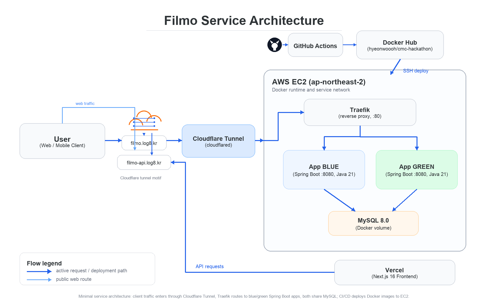

# 🎬 Filmo (필모)

> 영화관에서의 모든 순간을 기록하는 서비스
> CMC Hackathon — Server (Backend) 레포지토리

## 🔗 Links

| 항목               | URL                                             |
| ------------------ | ----------------------------------------------- |
| 🌐 Web (Frontend)  | https://filmo.log8.kr                           |
| 📡 API Base        | https://filmo-api.log8.kr                       |
| 📚 Swagger UI      | https://filmo-api.log8.kr/swagger-ui/index.html |
| 🗂 API Docs (JSON) | https://filmo-api.log8.kr/v3/api-docs           |
| 🗃 ERD             | https://dbdiagram.io/d/6a08ae7b9f1f8ec47b2e1355 |

## 🧩 Tech Stack

- **Language / Runtime**: Java 21, Spring Boot 3
- **Persistence**: Spring Data JPA, MySQL 8.0
- **Auth**: Spring Security + JWT (Bearer)
- **API Doc**: springdoc-openapi (Swagger UI)
- **Build**: Gradle 8
- **Container**: Docker / docker-compose (blue-green)
- **Reverse Proxy**: Traefik v3
- **CI/CD**: GitHub Actions → Docker Hub → EC2 SSH 무중단 배포
- **Edge**: Cloudflare Tunnel (cloudflared)

## 🗺 Architecture



```
iOS / Android ──HTTPS──► filmo-api.log8.kr ──► Cloudflare Tunnel (cloudflared)
                                                       │
                                                       ▼
                                            EC2 (ap-northeast-2)
                                                 └─ Traefik :80
                                                      ├─► App BLUE  (Spring Boot :8080)
                                                      └─► App GREEN (Spring Boot :8080)
                                                               └─► MySQL 8.0
GitHub ──push main──► GitHub Actions ──► Docker Hub ──SSH──► EC2 (blue-green swap)
```

## 🗃 ERD


| Table           | 설명                                                           |
| --------------- | -------------------------------------------------------------- |
| `users`         | 사용자 계정 (loginId/password/nickname/intro, soft delete)     |
| `movie`         | 영화 메타데이터 (indieground crawl)                            |
| `theater`       | 영화관/스크린 정보 (영화관입장권통합전산망)                    |
| `ticket`        | 사용자가 기록한 관람 티켓 (user × movie, review·날짜·공유여부) |
| `saved_theater` | 사용자가 저장한 영화관 (user × theater 다대다 조인)            |
| `collection`    | 사용자가 저장한 티켓 (user × ticket)                       |
| `likes`         | 티켓 좋아요 (user × ticket)                               |
| `comment`       | 티켓 댓글 (user × ticket, soft delete)                   |

## 📦 Project Structure

```
src/main/java/com/cmchackathon/
├── domain/
│   ├── user/           # 사용자 (로그인, 프로필)
│   ├── movie/          # 영화 도메인
│   ├── theater/        # 영화관 도메인
│   ├── ticket/         # 관람 티켓
│   ├── collection/     # 티켓 컬렉션 (저장)
│   ├── like/           # 좋아요
│   └── comment/        # 댓글
└── global/
    ├── config/         # Security, Swagger, DataInitializer
    ├── entity/         # BaseEntity (auditing)
    ├── exception/      # ErrorCode, GlobalExceptionHandler, BusinessException
    ├── jwt/            # JwtProvider, JwtFilter, EntryPoint, AccessDeniedHandler
    └── response/       # ApiResponse<T>
```

## ⚙️ Local Development

```bash
# 1. MySQL만 띄우기
docker compose -f docker-compose.local.yml up -d

# 2. 백엔드 실행 (default profile: local)
./gradlew bootRun
```

`.env.example` 참고하여 환경변수 구성.

## 🚀 Deployment

`main` 브랜치 push 시 자동 배포 (`.github/workflows/deploy.yml`):

1. Gradle 빌드
2. Docker 이미지 빌드 → Docker Hub push
3. EC2 SSH → `scripts/deploy.sh` 실행
4. idle 슬롯에 새 이미지 기동 → healthcheck 통과 시 Traefik 라우팅 swap → 구 슬롯 정리

→ **무중단 (zero-downtime) Blue-Green 배포**

## 🛡 API 응답 규약

모든 응답은 `ApiResponse<T>` 포맷으로 통일.

```json
{
  "code": 200,
  "message": "success",
  "data": { ... }
}
```

에러 응답도 동일 포맷 (필드별 validation 메시지는 `data`에 실어 반환):

```json
{
  "code": 1003,
  "message": "잘못된 입력입니다.",
  "data": { "nickname": "닉네임은 필수입니다." }
}
```

### 글로벌 예외 처리

`GlobalExceptionHandler`가 아래 케이스를 모두 잡아 일관된 응답을 보장 (500 방지):

| 상황                               | HTTP     | ErrorCode               |
| ---------------------------------- | -------- | ----------------------- |
| `@Valid` 실패 (필드별 메시지 포함) | 400      | `INVALID_INPUT`         |
| `@Validated` path/param 위반       | 400      | `INVALID_INPUT`         |
| 필수 파라미터 누락                 | 400      | `MISSING_PARAMETER`     |
| 파라미터 타입 불일치               | 400      | `TYPE_MISMATCH`         |
| JSON 파싱 실패                     | 400      | `INVALID_INPUT`         |
| 인증 실패 (토큰 없음/만료)         | 401      | `UNAUTHORIZED`          |
| 권한 부족                          | 403      | `FORBIDDEN`             |
| 메서드 불일치                      | 405      | `METHOD_NOT_ALLOWED`    |
| 리소스 없음                        | 404      | `NOT_FOUND`             |
| 비즈니스 예외                      | 도메인별 | `BusinessException`     |
| 미처리 예외                        | 500      | `INTERNAL_SERVER_ERROR` |

## 📋 해커톤 평가 체크리스트

[`docs/HACKATHON_CHECKLIST.md`](docs/HACKATHON_CHECKLIST.md) 참고.

## 👥 Team

| Role    | GitHub                                           |
| ------- | ------------------------------------------------ |
| Backend | [@hyeonwoooh](https://github.com/hyeonwoooh)     |
| Backend | [@IISweetHeartII](https://github.com/IISweetHeartII) |
